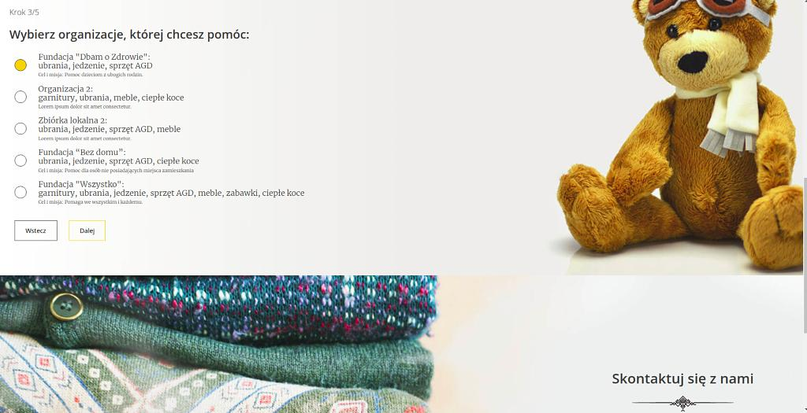
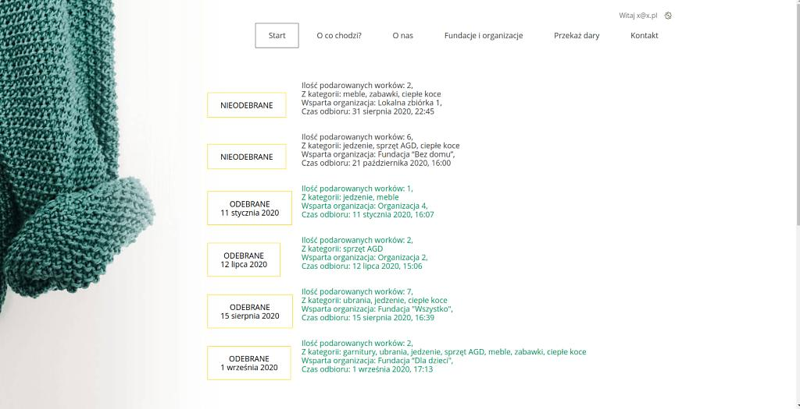
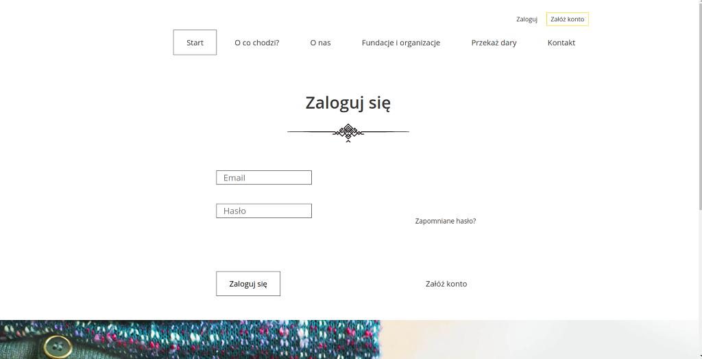

# Project Portfolio (Charity Donations)

A project where user can donate items to the organization of his/her choice. 

It contains comprehensive administration panel, dynamic data display, 
typical user logging and managing, password reset system,
archiving system for collected gifts, contact form e-mail handling.

_Python 3.6, Django 3.0.7, psycopg2-binary 2.8.5_

**Correct configuration of the file 'settings_local.py' is essential for proper use!**

###### Screenshots
---

---

---

---